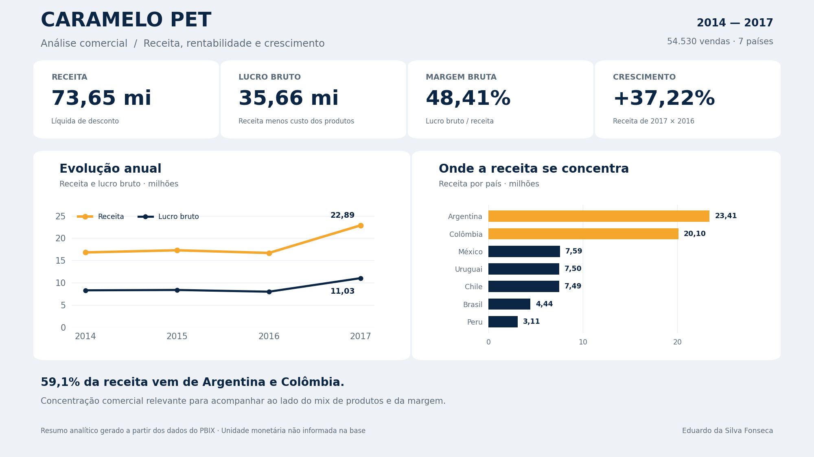

# Caramelo Pet · Análise de vendas em Power BI

**Da preparação da base às decisões de negócio:** um projeto de análise comercial com Power Query, modelo estrela, medidas DAX e um relatório interativo de seis páginas.



*Imagem de apresentação calculada a partir dos dados do PBIX. Explore os filtros e os visuais interativos no Power BI Desktop.*

**[Baixar o dashboard final (.pbix)](dashboard/pratique_powerbi.pbix)** · **[Explorar o projeto editável](projeto/)** · **[Consultar as medidas DAX](docs/METRICAS.md)**

## O problema de negócio

Como as vendas evoluíram ao longo do tempo? Quais países concentram receita? O crescimento veio acompanhado de rentabilidade? O relatório reúne essas perguntas para orientar a análise por período, localização e produto.

O projeto utiliza a base educacional da Caramelo Pet disponibilizada na atividade do curso. São **54.530 registros de venda**, **13 produtos cadastrados**, **7 representantes** e **7 localidades**, de **2014 a 2017**.

## Principais resultados

| Indicador | Resultado no período completo |
| :--- | ---: |
| Receita líquida de desconto | 73.651.617,59 |
| Custo dos produtos | 37.993.700,77 |
| Lucro bruto | 35.657.916,82 |
| Margem bruta | 48,41% |
| Unidades vendidas | 4.026.277 |
| Crescimento da receita · 2017 × 2016 | 37,22% |

Os valores financeiros usam a unidade monetária da base, que não informa uma moeda. O lucro é **bruto**: despesas operacionais não estão incluídas.

- **A receita de 2017 cresceu 37,22%** em relação a 2016, chegando a 22,89 milhões.
- **Argentina e Colômbia concentram 59,1% da receita** registrada, uma concentração relevante para o acompanhamento comercial.
- **O Brasil apresenta margem de 47,45%**, a menor entre os países da base. Aprofundar a análise de mix de produtos, descontos e fatores de custo pode ajudar a investigar essa diferença.

Essas conclusões descrevem o período completo. Os resultados do relatório mudam conforme os filtros selecionados.

## Como abrir

1. Acesse [dashboard/pratique_powerbi.pbix](dashboard/pratique_powerbi.pbix) e baixe o arquivo pelo botão de download do GitHub.
2. Abra `pratique_powerbi.pbix` no **Power BI Desktop** para Windows.
3. Navegue entre as páginas e use os filtros de **data**, **cidade** e **subcategoria de produto**.

O PBIX contém os dados importados e a definição do relatório. Para recalcular a base incorporada, use **Página Inicial → Atualizar**. Não é necessário configurar um caminho de arquivo externo nem credenciais de fonte de dados.

Para editar o projeto em arquivos de texto, baixe o repositório inteiro em **Code → Download ZIP**, extraia a pasta e abra `projeto/pratique_powerbi.pbip` em uma versão do Power BI Desktop com suporte a PBIP. Mantenha juntas as pastas `.Report` e `.SemanticModel`.

O GitHub disponibiliza os arquivos e a documentação; a interação com o relatório acontece no Power BI Desktop.

## O que há no relatório

| Página | Objetivo |
| :--- | :--- |
| **Resumo** | Panorama de receita, unidades, lucro e indicadores de desempenho. |
| **Receita** | Evolução e distribuição da receita nos recortes da base. |
| **Vendas** | Volume, produtos e composição das vendas. |
| **Cidades** | Comparação geográfica e relação entre receita e lucro. |
| **Conclusões** | Insights, recomendações de investigação e limites da análise. |
| **Medidas** | Explicação dos cálculos, indicadores e preparação dos dados. |

O relatório inclui **cinco cartões**, **duas tabelas visuais**, gráficos de linhas, barras, rosca e dispersão, além de títulos dinâmicos, filtros sincronizados, navegação entre páginas e uma página de tooltip oculta.

## Como foi construído

- **Power Query:** dados incorporados em CSV comprimido, conversão de tipos, tratamento da base e construção do calendário.
- **Modelagem:** uma tabela fato e quatro dimensões, com relacionamentos ativos de muitos para um e filtro da dimensão para a fato.
- **DAX:** 71 medidas com descrições, incluindo margem bruta, crescimento da receita acumulada, totais e títulos dinâmicos.
- **Validação:** conferência de chaves, relacionamentos, totais, referências dos visuais e estados das medidas no PBIX final.

Consulte [o modelo e as transformações](docs/MODELO.md), [as medidas](docs/METRICAS.md) e [a conferência técnica](docs/VALIDACAO.md).

## Estrutura do projeto

| Caminho | Conteúdo |
| :--- | :--- |
| `dashboard/` | PBIX final, pronto para abrir no Desktop. |
| `projeto/` | PBIP com relatório e modelo semântico editáveis. |
| `docs/` | Modelo, catálogo DAX, validação e imagem de apresentação. |
| `dados/` | Resumos anuais e por país, extraídos do PBIX final. |
| `scripts/` | Script para reproduzir a imagem de apresentação. |

### Reproduzir os gráficos do README

Com Python 3.12 e o repositório baixado:

```bash
python -m pip install -r scripts/requirements.txt
python scripts/gerar_visao_geral.py
```

O script lê os dois CSVs de resumo e gera `docs/assets/visao-geral.png`.

---

**Autor:** [Eduardo da Silva Fonseca](https://github.com/eduardosilvafonseca18-netizen)  
Projeto de portfólio em análise de dados e Business Intelligence, desenvolvido a partir de uma atividade educacional.
